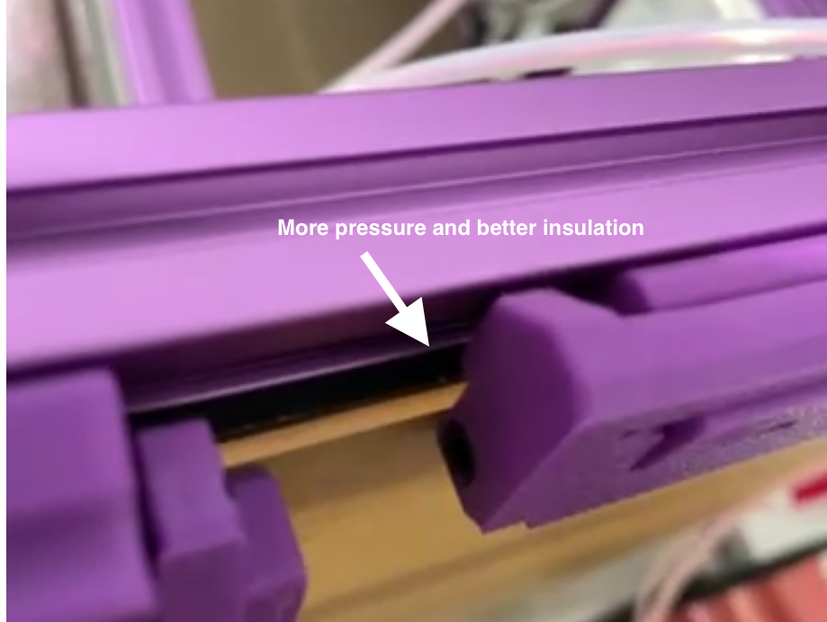

# Stronger Snap Latch with M3 Screw 

> [!TIP]
> *Because any voron builder has tons of spare M3 screws!*

This repo is based in the amazing works from:

 - Original Snap Latch: https://github.com/VoronDesign/VoronUsers/tree/master/printer_mods/richardjm/snap-latch-2020
 - Snap Latch for M2 Screws - where I take the cad to modify: https://www.printables.com/model/643837-wide-voron-panel-snap-latch-with-lip-using-m2-scre
 - QD Panel Mod, uses M1.6 and M2 Screws - where I take the corners to modify: https://github.com/MotorDynamicsLab/VoronQDPanelMod

# Motivation

M2 and M1.6 screws are very hard to find on local stores, at least where I live. And it takes a lot of screws to cover every
side of a voron!! So, it would take weeks of waiting to get all thoses tiny screws.

But I have tons of spare M3x8, M3x10, M3x12, SHCS and BHCS, from my voron builds. And I thing most of voron builders have it too. 
So I modified these designs to fit with our spare screws!

I found the current designs a little weak too, to really squish and insulate the panels.

# Modifications made:

- Suport for M3 Screws. It works with either 8mm, 10mm or 12mm, both SHSC and BHSC. **You can even mix screw sizes!**
- Outer Hinge with a Straight line: The orignal design uses a curve for the outer hinge sweep path. It makes all the pressure be concentrated in just a
   few milimeters of plastic. I changed it to have a straight line in the middle, so it distribute all the pressure in a wide area. 
- Stronger outer hinge - 8mm diameter instead of 5mm: I adjusted the cad to allow customize the outer hinge diameter. 
It allows to apply far more pressure to the panels without any plastic fadigue.
- I modified the corners for QD Panel Mod to fit better. The original design didn't hold strong in the frames for me.

# TODO:

- [x] Corner for 3mm foam tape
- [x] Corner for 1mm foam tape
- [x] Snap Latch for 3mm foam tape
- [x] Snap Latch for 1mm foam tape
- [ ] Door hinges
